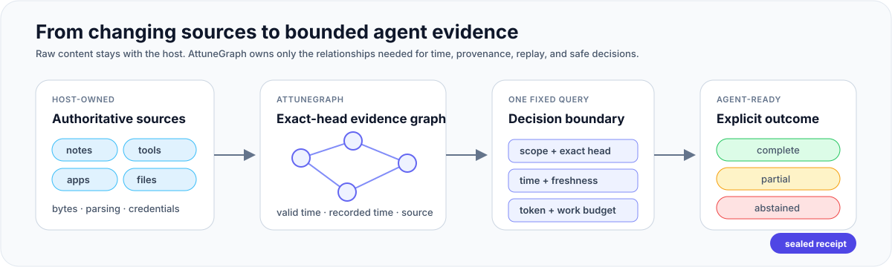
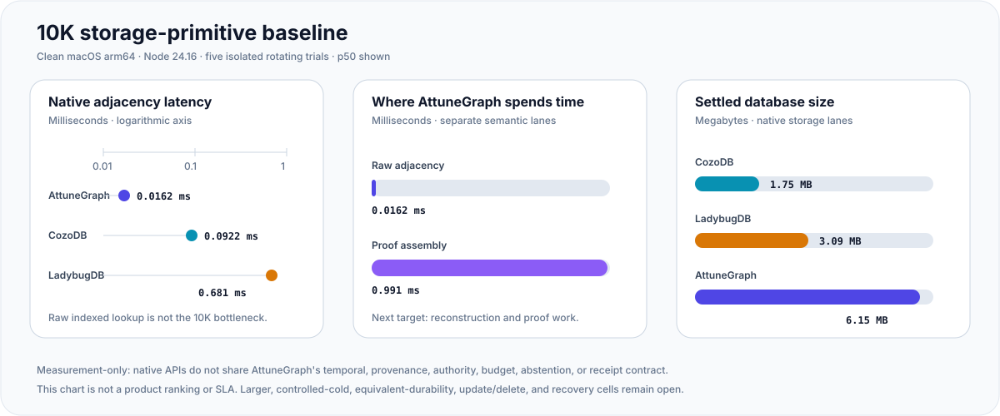

# AttuneGraph

> An embedded temporal and provenance database that compiles bounded,
> inspectable evidence for AI-agent decisions.

`@attunegraph/core` turns host-owned observations into an exact-head Working
Graph with source references. Its fixed-profile Decision Query can be expressed
as a typed object or bounded AttuneQL and returns an explicit `complete`,
`partial`, or `abstained` result plus a content-addressed evidence receipt.

**Project status:** usable from source today · not yet published to a package registry · no hosted service · Apache-2.0

<p align="center">
  <a href="#quick-start-from-source">Quick start</a> ·
  <a href="#agent-bootstrap-contract">Agent bootstrap</a> ·
  <a href="#what-ships-today">Shipped contracts</a> ·
  <a href="#current-measured-baseline">Measured baseline</a> ·
  <a href="BENCHMARKS.md">Benchmarks</a>
</p>

<p align="center">
  
</p>

## Quick start from source

Requires Node.js 22.12 or newer. Node.js 24.15 or newer is required for the
local SQLite and Admin profiles.

```sh
git clone https://github.com/wlsdks/attunegraph.git
cd attunegraph
corepack enable
pnpm install --frozen-lockfile
pnpm example
```

The example projects one source-linked observation, runs the bounded query
below, and prints its explicit status, Working Graph, and receipt ID:

```text
EVIDENCE FOR thread("thread:incident-42")
IN SCOPE("support-desk", "incident-42")
AS OF "2026-07-31T09:00:00.000Z"
AT CURRENT HEAD
REQUIRE FRESH
BUDGET 500 TOKENS;
```

AttuneQL is parsed into the same canonical typed query object; text is never
executed directly. The standalone
[`examples/basic-agent.mjs`](examples/basic-agent.mjs) contains the complete
projection and query flow; the [typed API](#typed-api) explains transported
result admission.

### Agent bootstrap contract

An AI coding agent can use this README as the setup contract. It should not
wait for a human to choose ordinary implementation details:

| If the target needs | Agent action |
| --- | --- |
| Evaluation or tests | Use the public in-memory testing Store |
| Durable single-host operation | Use `@attunegraph/core/local` with a private absolute SQLite path on Node.js >=24.15 |
| Markdown, PDF, Notion, tool results, or other host data | Keep raw bytes in the host and connect `@attunegraph/core/source-adapter` |
| A non-SQLite Store | Implement `@attunegraph/core/backend` only when the host already has a measured reason |

The package is **not on a registry yet**. Clone or pin this source checkout;
do not install a similarly named package. Record `git rev-parse HEAD`, use only
the [public interfaces](#public-interfaces), and validate the checkout before
editing a host:

```sh
pnpm typecheck
pnpm test:focused
pnpm example
pnpm example:source-adapter
pnpm pack:dry-run
```

Then derive an explicit `scope`, exact `threadRoot`, source ownership, and—when
actions are possible—authority policy from the host. New complete observations
must use `canonical-projection@2`; queries must bind scope, time, head,
freshness, and budget. Treat `partial`, `abstained`, stale, corrupt, or
unsupported states as non-complete, and never treat a receipt as permission.
Only ask a human when those semantic authorities cannot be determined safely.

For distribution acceptance, `pnpm verify:clean-room-consumer` packs the
artifact, installs it into a private temporary consumer, imports every public
export, and rejects private source subpaths.

AttuneGraph is not a smaller Neo4j. It decides which relationships an agent may use as evidence **now**, under time, provenance, freshness, and context budgets.

## Current measured baseline

The clean 2026-08-02 macOS arm64, Node 24.16 10K storage-primitive run gives a
useful, deliberately narrow answer about the engine today:

<p align="center">
  
</p>

- **Fast today:** raw indexed adjacency measured about **0.0162 ms p50**;
  SQLite is not the limiting lookup component in this cell.
- **Cost today:** exact-head/source/provenance proof assembly measured about
  **0.991 ms p50**, while the settled AttuneGraph database used **6,148,096
  bytes**. Reconstruction, write amplification, and representation density need
  more work.
- **Decision:** keep SQLite as the authoritative embedded store for now. A
  derived read plane becomes a candidate only when larger profiles prove it is
  necessary.

The comparison used 10,000 assertions/edges and exact adjacency/degree oracles
with LadybugDB 0.19.0 and CozoDB 0.7.6. Their native APIs do **not** provide the
same temporal, provenance, authority, budget, or abstention contract, so these
numbers are not a product ranking or SLA. Controlled-cold, update/delete,
equivalent-durability, crash-recovery, 100K, and 1M comparison cells remain
unverified. See [the reproducible benchmark](BENCHMARKS.md#10k-embedded-competitor-parity-lane)
and [the storage decision record](https://github.com/wlsdks/attunegraph/blob/main/docs/decisions/storage-engine-and-temporal-layout-research.md#competitor-parity-decision-2026-08-02)
for conditions, source identity, and open gaps.

## Why agents need a different graph

Long-lived agents rarely fail because one fact is impossible to retrieve. They
fail because the relationships around that fact have changed.

| Agent failure | AttuneGraph contract |
| --- | --- |
| Uses a fact after it was revised | Valid time, recorded time, and supersession remain distinct |
| Treats a nearby edge as truth or permission | Proximity never becomes evidence class, policy, feedback, or authority |
| Hides uncertainty after a budget cut | Incomplete work returns `partial` or `abstained`, never a false `complete` |
| Cannot explain which state informed an action | Exact heads, canonical ordering, and content-addressed receipts support repeatable current-head reads |
| Cannot tell what a revoked source affected | Revocation Impact returns deterministic dependency witnesses before mutation |

The database preserves only relationships whose loss would force reconstruction
or weaken explanation, invalidation, or replay. Raw records stay at the source.

## Ownership boundary

| Boundary | Owner |
| --- | --- |
| Source bytes, credentials, parsing, OCR, embeddings, model calls | Host application |
| Immutable projections, temporal/provenance semantics, exact heads, bounded traversal | AttuneGraph |
| Decision, permission, action, and external effects | Agent application |

## What ships today

| Contract | Available now | Explicit boundary |
| --- | --- | --- |
| Decision evidence | `decision-query@1`, bounded AttuneQL, exact-head token-bounded Working Graph, receipt, and explicit `complete` / `partial` / `abstained` | No proof-closed `DecisionContext` with completed authority and conflict evaluation |
| Action authority | Typed `authority-query@1`, bitemporal exact-root witnesses, conflict abstention, and a result-bounded receipt | No general policy engine, historical-head read, AttuneQL authority grammar, or action execution |
| Time and provenance | Valid and recorded time, supersession, freshness, and exact source refs | Does not independently prove an external source true or current |
| Embedded storage and portability | In-memory oracle, worker-isolated local SQLite, canonical `.atgx`, and fixtures | No distributed, multi-tenant, hosted database, or compatibility aliases for superseded identities |
| Revocation and operations | Exact-head impact plan, guarded source-authoritative transition, and offline read-only Admin | No persisted receipt pins, pruning, compaction, online repair, or write administration |
| Scale and distribution | Revision-bound measurement harnesses, source-checkout use, and dry-run package verification | No 10M/50M qualification, production SLA, or npm registry publication |

See the [first-principles contract](docs/architecture/first-principles.md) for
the problem definition, graph inclusion rules, and explicit shipped versus
directional boundary.

## Typed API

AttuneQL and typed Decision Query share one canonical execution path:

```ts
const result = await graph.query({
  operator: "decision-query@1",
  scope,
  seed: threadRoot,
  asOf: now,
  head: { mode: "current" },
  freshness: { require: "fresh" },
  budget: { maxEstimatedTokens: 2000 }
});
```

Transported full results can be re-admitted with
`admitDecisionQueryResult(JSON.parse(JSON.stringify(result)))`. Admission
recomputes the bounded Working Graph and receipt from the supplied bytes; it
does not re-read the Store or prove external truth, permission, or authority.
See the [first-principles contract](docs/architecture/first-principles.md) for
the full closure and limit rules.

Callers choose the anchor, scope, time, head posture, freshness, and budgets.
They cannot choose relationship families, omit counterevidence, add writes, or
turn graph proximity into permission.

For an action-permission decision, use the typed authority operator. It has no
text grammar and never executes an action:

```ts
const authority = await graph.queryAuthority({
  operator: "authority-query@1",
  scope,
  action: { kind: "action", id: "action:publish" },
  threadRoot,
  asOf: now,
  head: { mode: "current" },
  freshness: { require: "fresh" },
  budget: { maxEstimatedTokens: 4000 }
});

if (authority.status === "complete" && authority.authority === "authorized") {
  console.log(authority.witness, authority.receipt.receiptId);
}
```

`authorized` requires eligible, non-hypothesis witnesses for
`action GOVERNED_BY policy`, `policy SCOPED_TO threadRoot`,
`action AUTHORIZED_BY evidence`, and `evidence OBSERVED_DURING threadRoot`.
Any missing closure, root uncertainty, stale/future posture, conflict, or work
cut remains `undetermined`; the host still owns action execution.

## When to choose AttuneGraph

| Need | Best fit |
| --- | --- |
| Time/provenance-aware, token-bounded evidence for one agent decision | AttuneGraph |
| Arbitrary Cypher, general graph analytics, clustering, or multi-user serving | General graph database |
| Semantic candidate discovery across large text collections | Vector or lexical retrieval system |
| Both discovery and decision admissibility | Retrieval proposes candidates; AttuneGraph applies the final evidence boundary |

A general database can reproduce these behaviors with application code.
AttuneGraph makes them one fail-closed decision-evidence contract.

The mechanism and benchmark decisions behind this boundary are recorded in
[agent-native graph positioning](docs/decisions/agent-native-graph-positioning.md).

## Source adapters

`@attunegraph/core/source-adapter` is the provider-neutral ingestion seam. A
host can connect Markdown, text, PDF, spreadsheets, Obsidian, Notion, tool
results, or any other source without moving raw source bytes into the graph.

Adapters emit bounded assertions with exact anchors and parser provenance;
AttuneGraph content-binds the adapter identity, source kind, caller
correlation, and resulting observation before one `projectAgainstHead` write.

- API and ownership: [SOURCE-ADAPTERS.md](SOURCE-ADAPTERS.md)
- Standalone host-neutral example:
  [`examples/source-adapter-agent.mjs`](examples/source-adapter-agent.mjs)

## Durable local SQLite

```ts
import { openLocalAttuneGraph } from "@attunegraph/core/local";

const graph = await openLocalAttuneGraph({
  databasePath: "/absolute/local/path/attunegraph.sqlite",
  scope: { sourceId: "notes", threadId: "trip-planning" }
});

console.log(await graph.head());
await graph.close();
```

The local profile keeps SQLite, SQL, worker transport, and physical schema
private. It validates runtime, filesystem ownership and mode, physical
identity, schema, and safety pragmas before serving data. Unsupported or
corrupt stores fail closed. Use `projectAgainstHead()` when a host means to
apply a validated observation to the head current at operation start.

For many scopes in one database lifecycle, use
`openLocalAttuneGraphSession()`. One session owns one SQLite worker; closing a
scope handle leaves the other handles and session alive.

## Revocation Impact and transition

Plan the current and transitive derived assertions affected by a future
revocation without changing the graph:

```ts
const plan = await graph.planRevocationImpact({
  operator: "revocation-impact@1",
  selector: { sourceRefs: [{ namespace: "notes", id: "trip-plan" }] },
  maxAssertions: 16,
  maxConsideredAssertions: 256
});

console.log(plan.status, plan.impacts, plan.receipt.receiptId);
```

Selectors accept bounded assertion IDs, graph refs, and source refs. Versioned
source refs match exactly; versionless refs match every version with the same
namespace and ID. Dependency cycles terminate, equal shortest witnesses settle
lexicographically, and either work cap produces `partial`.

An impact receipt is not deletion authority. The guarded transition accepts
only a newer, fresh `canonical-projection@2` replacement from the source owner,
preserves the predecessor's exact V2 thread root, and proves that the
replacement contains exactly the surviving assertions—no additions, edits, or
extra deletions. A stale plan fails closed. One exact-head CAS may commit; an
identical concurrent winner may return `converged`, while a later retry fails
instead of claiming predecessor proof without a persisted receipt pin.

The source system remains authoritative and the transition receipt binds its
replacement observation. Persisted receipt pins, historical lookup, retention,
pruning, and SQLite compaction remain unshipped. The process-local
`InMemoryAttuneGraphDataStore.forget()` is a physical-delete utility, not this
durable protocol.

## Admin and portable artifacts

| Interface | Purpose | Boundary |
| --- | --- | --- |
| `@attunegraph/core/admin` | Inspect summaries, heads, and integrity | Offline, read-only, explicitly closed and quiescent Store |
| `.atgx` | Canonical multi-scope transport | NDJSON with exact framing, hashes, ordering, and limits |

The Admin interface exposes no SQLite handle, filesystem authority, repair,
export, or mutation primitive. Portable artifacts created under superseded
identities are rejected rather than silently reinterpreted.

- Portable wire contract: [PORTABLE-FORMAT.md](PORTABLE-FORMAT.md)
- Checked-in fixtures: [`fixtures/portable-v1/`](fixtures/portable-v1/)

## Public interfaces

| Import | Use |
| --- | --- |
| `@attunegraph/core` | Engine lifecycle, projection, Decision Query, transported full-result admission, AttuneQL, Working Graph, Revocation Impact |
| `@attunegraph/core/source-adapter` | Typed host-source ingestion |
| `@attunegraph/core/local` | Durable worker-isolated SQLite |
| `@attunegraph/core/admin` | Offline read-only inspection |
| `@attunegraph/core/backend` | Expert Store adapter seam |
| `@attunegraph/core/readonly-working-graph` | Offline Working Graph read from a closed local Store |
| `@attunegraph/core/testing` | In-memory adapters and conformance contracts |
| `@attunegraph/core/extension-kit` | Canonicalization, validation, settlement, witness primitives |

Source filenames and unlisted package subpaths are private.

## Compatibility and safety

| Interface | Runtime | Reviewed operating systems |
| --- | --- | --- |
| Core, in-memory, portable wire/decoder | Node.js >=22.12 | Linux, macOS, Windows |
| Local SQLite, offline Admin, read-only Working Graph | Node.js >=24.15 | Linux, macOS |

The core package has no runtime package dependencies. Node built-ins and the
declared runtime versions are still required. Unsupported local-profile hosts
fail closed; they do not fall back to a weaker Store.

Identifiers such as `working-graph@1` and `canonical-projection@2` are wire or
persisted-contract revisions, not product maturity labels. They change only
when existing bytes would otherwise be interpreted with different semantics.
The package version in `package.json` is the product version.

Receipt wire changes never silently reinterpret old bytes. Migration actions
and compatibility breaks are recorded in the [changelog](CHANGELOG.md).

## Benchmarks and verification

```sh
pnpm typecheck
pnpm test:focused
pnpm test                 # cross-platform core, memory, and portable contracts
pnpm test:local-profile   # reviewed Linux/macOS SQLite and Admin profile
pnpm verify:working-graph-golden
pnpm pack:dry-run
```

Performance evidence is revision-, host-, dataset-, and semantic-hash-bound.
The checked-in harnesses are measurement tools, not a general production SLA,
a 10M/50M qualification, or proof that AttuneGraph is faster than Neo4j. A fair
comparison must give the baseline equivalent time, provenance, authority,
budget, and partiality semantics.

- Workloads and claim limits: [BENCHMARKS.md](BENCHMARKS.md)
- Qualification policy: [PERFORMANCE-QUALIFICATION.md](PERFORMANCE-QUALIFICATION.md)
- Gate and evidence contracts: [READINESS.md](READINESS.md)

## Documentation

| Document | Question answered |
| --- | --- |
| [First principles](docs/architecture/first-principles.md) | Why does this database exist, and what belongs in the graph? |
| [First-principles performance](docs/decisions/first-principles-performance.md) | Which implementation parts are candidates now, which require measurement, and what would falsify them? |
| [Source adapters](SOURCE-ADAPTERS.md) | How does a host connect structured and unstructured sources? |
| [Portable format](PORTABLE-FORMAT.md) | How are `.atgx` artifacts framed and admitted? |
| [Benchmarks](BENCHMARKS.md) | What is measured, and which claims are forbidden? |
| [Performance qualification](PERFORMANCE-QUALIFICATION.md) | What evidence is required before performance claims? |
| [Readiness](READINESS.md) | Which checks and artifacts define a verified revision? |
| [Contributing](CONTRIBUTING.md) | How should changes be proposed and verified? |
| [Security](SECURITY.md) | How should vulnerabilities be reported? |

Development workflow: [CONTRIBUTING.md](CONTRIBUTING.md) · License:
[Apache-2.0](LICENSE)
