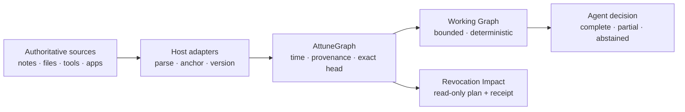

# AttuneGraph

> An embedded temporal and provenance database that compiles bounded,
> inspectable evidence for AI-agent decisions.

`@attunegraph/core` turns host-owned observations into an exact-head Working
Graph with source references and an explicit `complete`, `partial`, or
`abstained` result.

**Project status:** usable from source today · not yet published to a package registry · no hosted service · Apache-2.0

AttuneGraph is not a smaller Neo4j. It decides which relationships an agent may use as evidence **now**, under time, provenance, freshness, and context budgets.

## Why agents need a different graph

Long-lived agents rarely fail because one fact is impossible to retrieve. They
fail because the relationships around that fact have changed.

| Agent failure | AttuneGraph contract |
| --- | --- |
| Uses a fact after it was revised | Valid time, recorded time, and supersession remain distinct |
| Treats a nearby edge as truth or permission | Proximity never becomes evidence class, policy, feedback, or authority |
| Hides uncertainty after a budget cut | Incomplete work returns `partial` or `abstained`, never a false `complete` |
| Cannot explain which state informed an action | Exact heads, canonical ordering, and content-addressed receipts support replay |
| Cannot tell what a revoked source affected | Revocation Impact returns deterministic dependency witnesses before mutation |

The database preserves only relationships whose loss would force reconstruction
or weaken explanation, invalidation, or replay. Raw records stay at the source.

## How it works



| Boundary | Owner |
| --- | --- |
| Source bytes, credentials, parsing, OCR, embeddings, model calls | Host application |
| Immutable projections, temporal/provenance semantics, exact heads, bounded traversal | AttuneGraph |
| Decision, permission, action, and external effects | Agent application |

## What ships today

| Area | Available now | Not claimed |
| --- | --- | --- |
| Decision evidence | Exact-head, deterministic, token-bounded Working Graph | A finished named `DecisionContext` / `ContextReceipt` API |
| Time and source | Validity, recording, supersession, freshness, exact source refs | Independent verification that an external source is true or current |
| Storage | In-memory oracle and worker-isolated local SQLite | Distributed, multi-tenant, or hosted database |
| Failure semantics | `complete`, `partial`, `abstained` | Universal relevance or answer correctness |
| Revocation | Exact-head impact plan and guarded source-authoritative transition | Persisted receipt pins, retention, pruning, or compaction |
| Portability | Canonical `.atgx` NDJSON and checked-in fixtures | Compatibility aliases for superseded identities |
| Operations | Offline, read-only Admin inspection | Online repair or write administration |
| Scale | Revision-bound measurement harnesses | Qualified 10M/50M production performance or an SLA |
| Distribution | Source-checkout use and dry-run package verification | npm registry publication |

See the [first-principles contract](docs/architecture/first-principles.md) for
the problem definition, graph inclusion rules, and explicit shipped versus
directional boundary.

## Quick start from source

Requires Node.js 22.12 or newer. Node.js 24 LTS is recommended and is required
for the local SQLite and Admin profiles.

```sh
git clone https://github.com/wlsdks/attunegraph.git
cd attunegraph
corepack enable
pnpm install --frozen-lockfile
pnpm example
```

The example projects one source-linked observation and compiles a bounded
Working Graph. The equivalent public API is:

```ts
import { openAttuneGraph } from "@attunegraph/core";
import { createInMemoryAttuneGraphStore } from "@attunegraph/core/testing";

const scope = { sourceId: "notes", threadId: "trip-planning" };
const threadRoot = { kind: "thread" as const, id: "thread:trip-planning" };
const now = "2026-08-01T09:00:00.000Z";

const graph = await openAttuneGraph({
  scope,
  store: createInMemoryAttuneGraphStore()
});

await graph.project({
  operator: "canonical-projection@2",
  observation: {
    schemaVersion: 2,
    observationKey: "notes-sync-42",
    scope,
    threadRoot,
    observedAt: now,
    sourceFreshness: { state: "fresh", observedAt: now },
    assertions: [{
      schemaVersion: 1,
      id: "trip-linked-to-hotel-comparison",
      subject: { kind: "artifact", id: "hotel-comparison" },
      predicate: "LINKED_TO",
      object: { ...threadRoot },
      epistemicClass: "source-observed",
      sourceRefs: [{ namespace: "example.notes", id: "travel.md#hotels" }],
      recordedAt: now,
      derivation: { kind: "projection", version: "example@1" }
    }]
  }
});

const result = await graph.execute({
  operator: "working-graph@1",
  seed: threadRoot,
  now,
  maxEstimatedTokens: 2_000
});

console.log(result.status, result.workingGraph);
await graph.close();
```

`canonical-projection@2` admits only the declared thread-root component before
Store I/O. See [`examples/basic-agent.mjs`](examples/basic-agent.mjs).

## When to choose AttuneGraph

| Need | Best fit |
| --- | --- |
| Time/provenance-aware, token-bounded evidence for one agent decision | AttuneGraph |
| Arbitrary Cypher, general graph analytics, clustering, or multi-user serving | General graph database |
| Semantic candidate discovery across large text collections | Vector or lexical retrieval system |
| Both discovery and decision admissibility | Retrieval proposes candidates; AttuneGraph applies the final evidence boundary |

A general database can reproduce these behaviors with application code.
AttuneGraph makes them one fail-closed decision-evidence contract.

## Source adapters

`@attunegraph/core/source-adapter` is the provider-neutral ingestion seam. A
host can connect Markdown, text, PDF, spreadsheets, Obsidian, Notion, tool
results, or any other source without moving raw source bytes into the graph.

Adapters emit bounded assertions with exact anchors and parser provenance;
AttuneGraph content-binds the adapter identity, source kind, caller
correlation, and resulting observation before one `projectAgainstHead` write.

- API and ownership: [SOURCE-ADAPTERS.md](SOURCE-ADAPTERS.md)
- Standalone host-neutral example:
  [`examples/source-adapter-agent.mjs`](examples/source-adapter-agent.mjs)

## Durable local SQLite

```ts
import { openLocalAttuneGraph } from "@attunegraph/core/local";

const graph = await openLocalAttuneGraph({
  databasePath: "/absolute/local/path/attunegraph.sqlite",
  scope: { sourceId: "notes", threadId: "trip-planning" }
});

console.log(await graph.head());
await graph.close();
```

The local profile keeps SQLite, SQL, worker transport, and physical schema
private. It validates runtime, filesystem ownership and mode, physical
identity, schema, and safety pragmas before serving data. Unsupported or
corrupt stores fail closed. Use `projectAgainstHead()` when a host means to
apply a validated observation to the head current at operation start.

For many scopes in one database lifecycle, use
`openLocalAttuneGraphSession()`. One session owns one SQLite worker; closing a
scope handle leaves the other handles and session alive.

## Revocation Impact and transition

Plan the current and transitive derived assertions affected by a future
revocation without changing the graph:

```ts
const plan = await graph.planRevocationImpact({
  operator: "revocation-impact@1",
  selector: { sourceRefs: [{ namespace: "notes", id: "trip-plan" }] },
  maxAssertions: 16,
  maxConsideredAssertions: 256
});

console.log(plan.status, plan.impacts, plan.receipt.receiptId);
```

Selectors accept bounded assertion IDs, graph refs, and source refs. Versioned
source refs match exactly; versionless refs match every version with the same
namespace and ID. Dependency cycles terminate, equal shortest witnesses settle
lexicographically, and either work cap produces `partial`.

An impact receipt is not authority to delete. Its only guarded write path asks
the source owner for a newer complete `canonical-projection@2` observation and
proves exact survivor subtraction against the current V2 head:

```text
current V2 head --plan--> complete impact receipt
       |                         |
       +--authoritative fresh V2 replacement, same thread root
                                 |
  replacement assertions = current assertions - planned impact assertions
                                 |
                    one exact-head CAS --> transition receipt
```

```ts
const transition = await graph.applyRevocationTransition({
  operator: "revocation-transition@1",
  receiptCanonicalJson: plan.receipt.canonicalJson,
  replacement: {
    operator: "canonical-projection@2",
    observation: sourceOwnerFreshReplacement
  }
});
```

The replacement must be fresh at its observation time, strictly newer than the
predecessor, preserve its exact V2 thread root, and contain neither additions,
edits, nor extra deletions. A stale plan fails closed. One CAS may commit; a
concurrent identical winner can return `converged`. A later retry fails rather
than claiming predecessor proof without a persisted receipt pin.

This is not graph-owned delete: source systems remain authoritative, and the
transition receipt binds the source observation that they supplied. Persisted
receipt pins, historical receipt lookup, retention, pruning, and SQLite
compaction remain explicitly unshipped. The legacy process-local
`InMemoryAttuneGraphDataStore.forget()` remains a physical-delete utility, not
this durable protocol.

Structured operators are the current query surface. An arbitrary `AttuneQL`
parser remains a future direction.

## Admin and portable artifacts

| Interface | Purpose | Boundary |
| --- | --- | --- |
| `@attunegraph/core/admin` | Inspect summaries, heads, and integrity | Offline, read-only, explicitly closed and quiescent Store |
| `.atgx` | Canonical multi-scope transport | NDJSON with exact framing, hashes, ordering, and limits |

The Admin interface exposes no SQLite handle, filesystem authority, repair,
export, or mutation primitive. Portable artifacts created under superseded
identities are rejected rather than silently reinterpreted.

- Portable wire contract: [PORTABLE-FORMAT.md](PORTABLE-FORMAT.md)
- Checked-in fixtures: [`fixtures/portable-v1/`](fixtures/portable-v1/)

## Public interfaces

| Import | Use |
| --- | --- |
| `@attunegraph/core` | Engine lifecycle, projection, Working Graph, Revocation Impact |
| `@attunegraph/core/source-adapter` | Typed host-source ingestion |
| `@attunegraph/core/local` | Durable worker-isolated SQLite |
| `@attunegraph/core/admin` | Offline read-only inspection |
| `@attunegraph/core/backend` | Expert Store adapter seam |
| `@attunegraph/core/readonly-working-graph` | Offline Working Graph read from a closed local Store |
| `@attunegraph/core/testing` | In-memory adapters and conformance contracts |
| `@attunegraph/core/extension-kit` | Canonicalization, validation, settlement, witness primitives |

Source filenames and unlisted package subpaths are private.

## Compatibility and safety

| Interface | Runtime | Reviewed operating systems |
| --- | --- | --- |
| Core, in-memory, portable wire/decoder | Node.js >=22.12 | Linux, macOS, Windows |
| Local SQLite, offline Admin, read-only Working Graph | Node.js >=24.15 | Linux, macOS |

The core package has no runtime package dependencies. Node built-ins and the
declared runtime versions are still required. Unsupported local-profile hosts
fail closed; they do not fall back to a weaker Store.

Identifiers such as `working-graph@1` and `canonical-projection@2` are wire or
persisted-contract revisions, not product maturity labels. They change only
when existing bytes would otherwise be interpreted with different semantics.
The package version in `package.json` is the product version.

## Benchmarks and verification

```sh
pnpm typecheck
pnpm test:focused
pnpm test                 # cross-platform core, memory, and portable contracts
pnpm test:local-profile   # reviewed Linux/macOS SQLite and Admin profile
pnpm verify:working-graph-golden
pnpm pack:dry-run
```

Performance evidence is revision-, host-, dataset-, and semantic-hash-bound.
The checked-in harnesses are measurement tools, not a general production SLA,
a 10M/50M qualification, or proof that AttuneGraph is faster than Neo4j. A fair
comparison must give the baseline equivalent time, provenance, authority,
budget, and partiality semantics.

- Workloads and claim limits: [BENCHMARKS.md](BENCHMARKS.md)
- Qualification policy: [PERFORMANCE-QUALIFICATION.md](PERFORMANCE-QUALIFICATION.md)
- Gate and evidence contracts: [READINESS.md](READINESS.md)

## Documentation

| Document | Question answered |
| --- | --- |
| [First principles](docs/architecture/first-principles.md) | Why does this database exist, and what belongs in the graph? |
| [Source adapters](SOURCE-ADAPTERS.md) | How does a host connect structured and unstructured sources? |
| [Portable format](PORTABLE-FORMAT.md) | How are `.atgx` artifacts framed and admitted? |
| [Benchmarks](BENCHMARKS.md) | What is measured, and which claims are forbidden? |
| [Performance qualification](PERFORMANCE-QUALIFICATION.md) | What evidence is required before performance claims? |
| [Readiness](READINESS.md) | Which checks and artifacts define a verified revision? |
| [Contributing](CONTRIBUTING.md) | How should changes be proposed and verified? |
| [Security](SECURITY.md) | How should vulnerabilities be reported? |

## Development

```sh
pnpm install --frozen-lockfile
pnpm typecheck
pnpm test:focused
pnpm build
pnpm example
```

See [CONTRIBUTING.md](CONTRIBUTING.md) for the full workflow. AttuneGraph is
licensed under [Apache-2.0](LICENSE).
